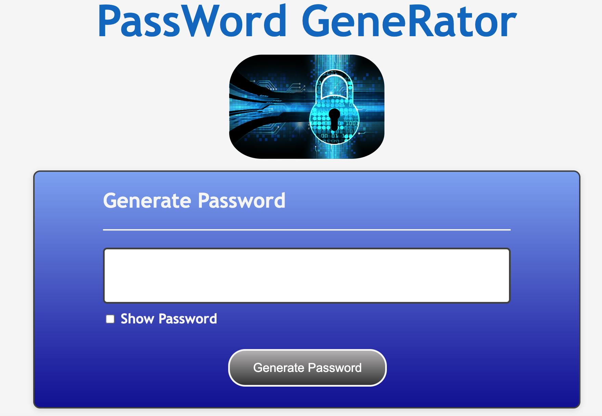
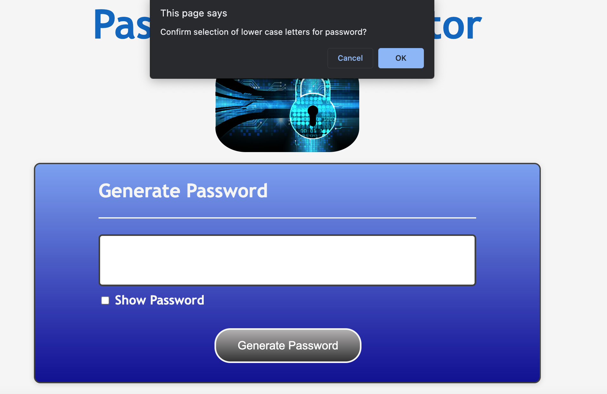
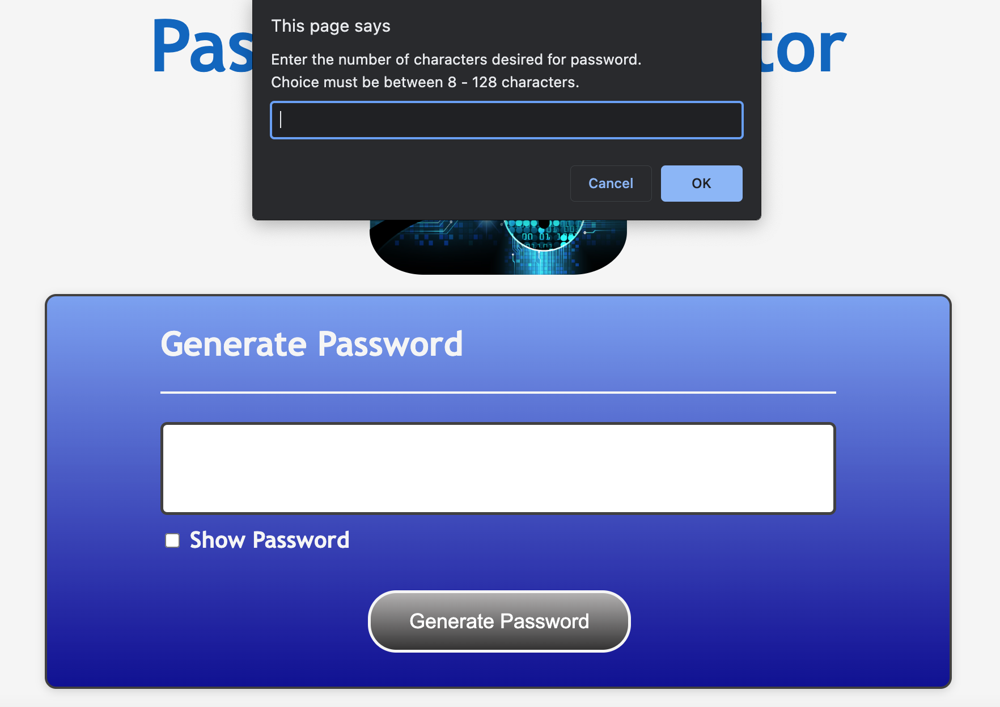
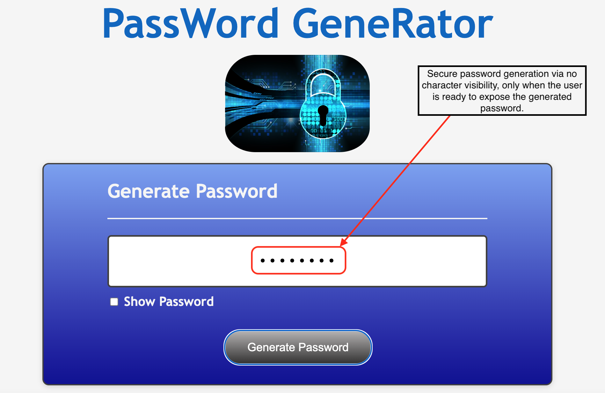
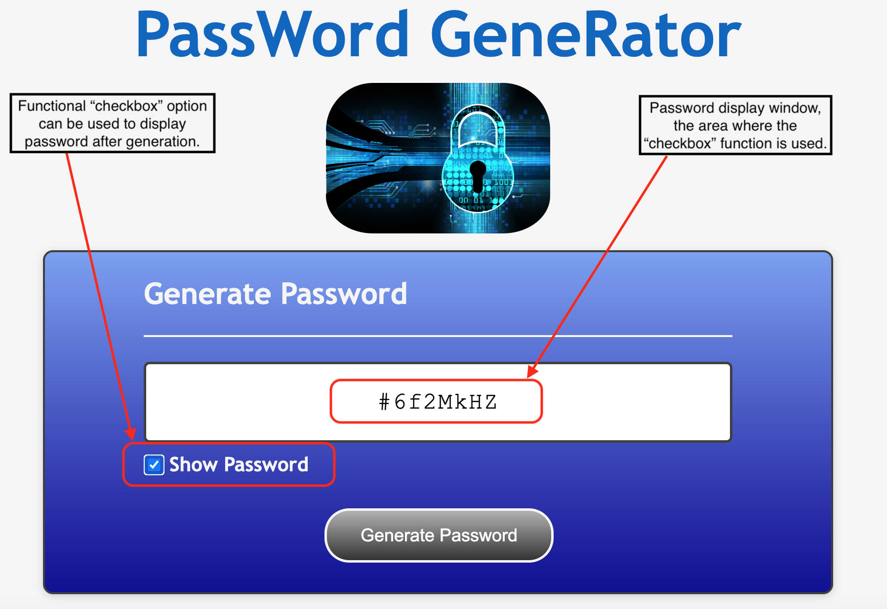
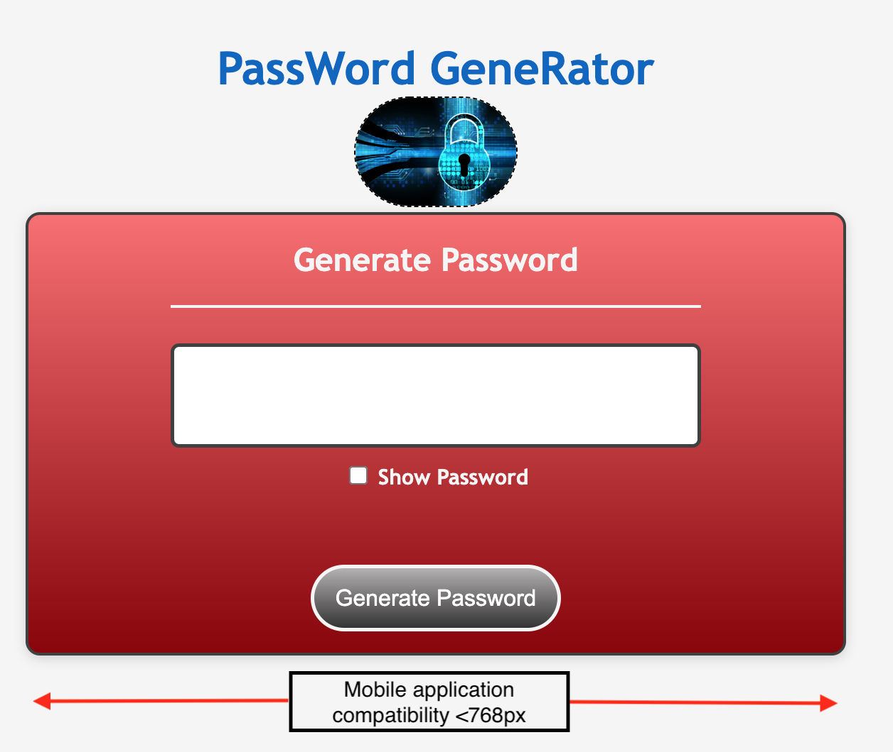
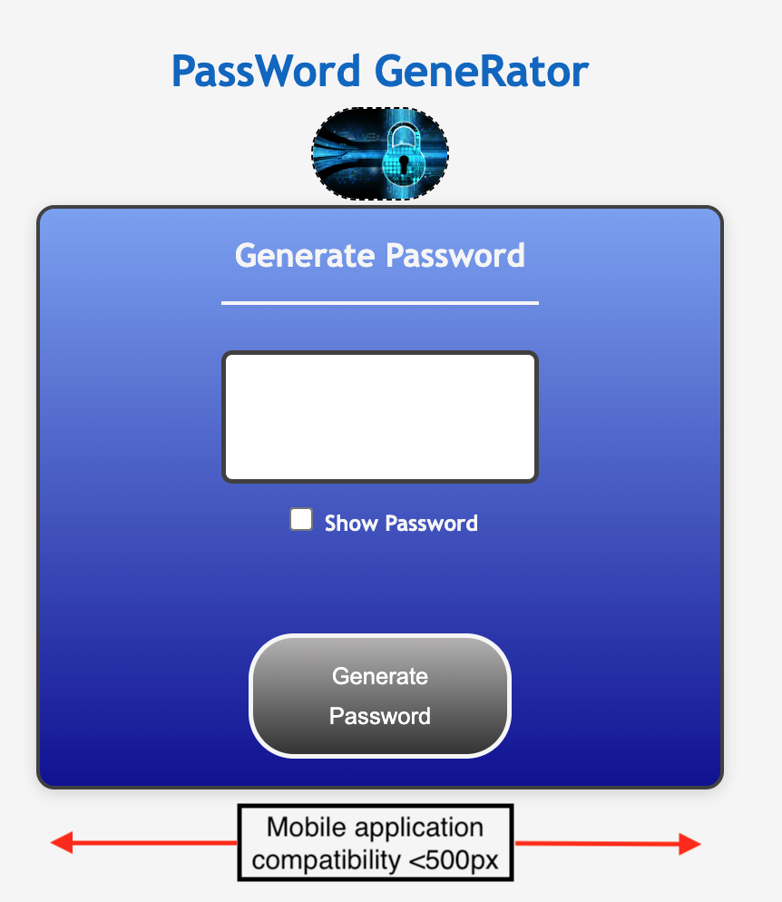

# JavaScript: SecRet PassWord GeneRator

## Application's Brief Description

The SecRet PassWord GeneRator is an easy to use application designed to generate random passwords using a variety of characters from letters, numbers, and special characters with a possible length of 8-128 characters!
The application features prompted messages where the user is informed of:

* Password length
* Use of specific characters
* Any potential error flags

The password can include special characters. If you’re unfamiliar with these, see this [list of password special characters](https://www.owasp.org/index.php/Password_special_characters) from the OWASP Foundation.

Overall, it is a user friendly application with mobile app capabilities built from HTML, CSS, and JavaScript codes.

Below is the acceptance criteria designated to ensure all quality and technical standards are met:


## Acceptance Criteria

```
GIVEN I need a new, secure password
WHEN I click the button to generate a password
THEN I am presented with a series of prompts for password criteria
WHEN prompted for password criteria
THEN I select which criteria to include in the password
WHEN prompted for the length of the password
THEN I choose a length of at least 8 characters and no more than 128 characters
WHEN asked for character types to include in the password
THEN I confirm whether or not to include lowercase, uppercase, numeric, and/or special characters
WHEN I answer each prompt
THEN my input should be validated and at least one character type should be selected
WHEN all prompts are answered
THEN a password is generated that matches the selected criteria
WHEN the password is generated
THEN the password is either displayed in an alert or written to the page
```

## Mock-Up

* The following gif and images shows the web application's appearance and functionality capabilities:








### Hidden Password



### Password Revealed



### Mobile Capability





## GitHUB Repository URL

https://github.com/AASports89/secret-password-generator

## Deployed Webpage URL

https://aasports89.github.io/secret-password-generator/

## Evaluation Requirements


The application is evaluated based on the following criteria: 

### Technical Acceptance Criteria: 40%

* Satisfies all of the preceding acceptance criteria.

### Deployment: 32%

* Application deployed at live URL.

* Application loads with no errors.

* Application GitHub URL submitted.

* GitHub repository that contains application code.

### Application Quality: 15%

* Application user experience is intuitive and easy to navigate.

* Application user interface style is clean and polished.

* Application resembles the mock-up functionality provided in the Challenge instructions.

### Repository Quality: 13%

* Repository has a unique name.

* Repository follows best practices for file structure and naming conventions.

* Repository follows best practices for class/id naming conventions, indentation, quality comments, etc.

* Repository contains multiple descriptive commit messages.

* Repository contains quality readme file with description, screenshot, and link to deployed application.
